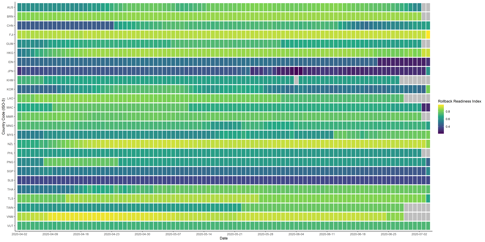
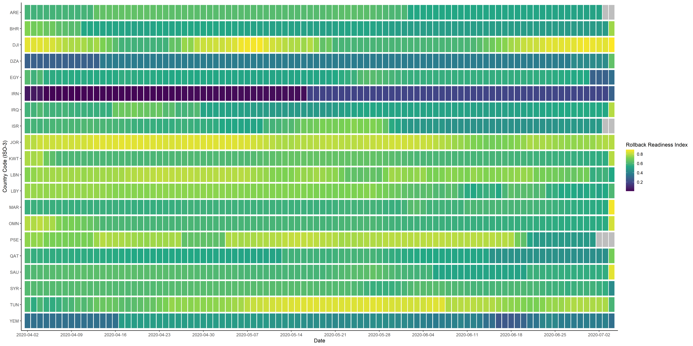
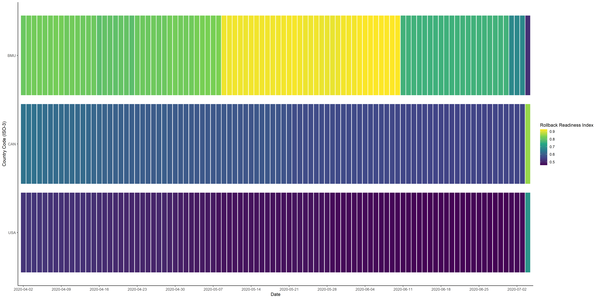
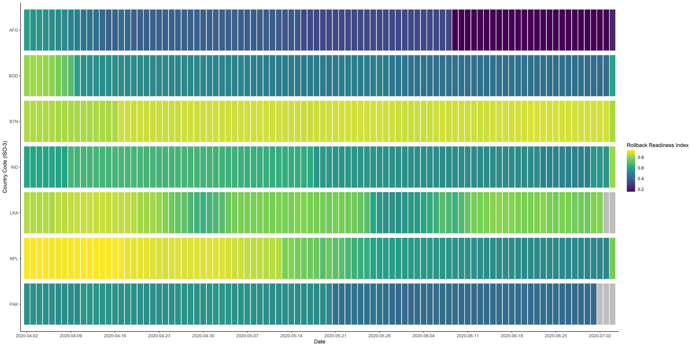

# BSG Tracker Rollback Analysis 

## Visualising Rollback Scores of countries over time 

### Preliminary Analyses
Distribution of Rollback scores over time 

##### 15th April 2020

##### 29th April 2020

##### 13th May 2020

##### 27th May 2020

##### 10th June 2020

##### 24th June 2020

#### Testing new graph plot window

 

### Heatmaps of rollback scores of countries over time 

